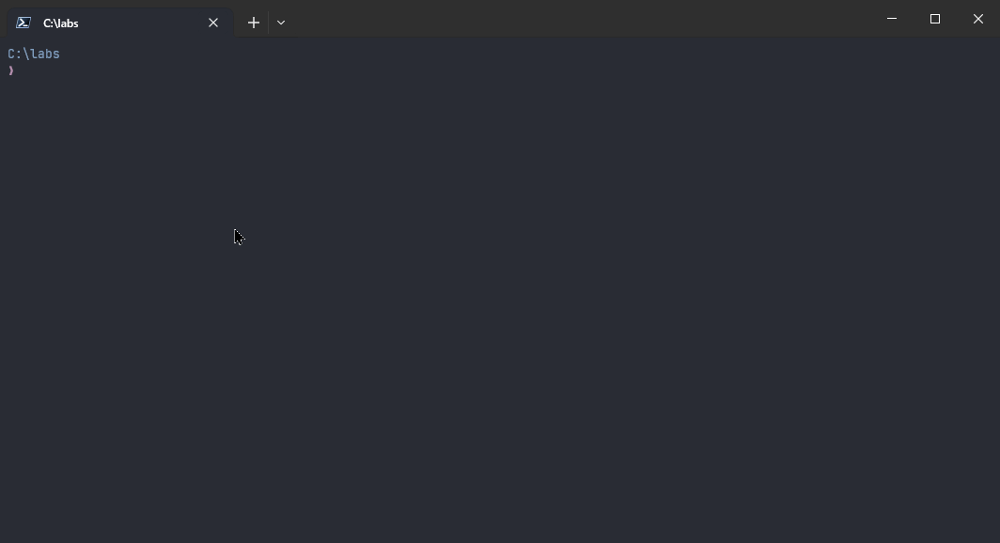

# @axa-fr/create-starter-design-system

## 🚧 Project Status

This project is currently **under construction**.  
No version has been published on npm yet.

## 🛠️ Build Status

[](https://github.com/samuel-gomez/starter-design-system/actions/workflows/build.yaml)
[](https://github.com/samuel-gomez/starter-design-system?tab=MIT-1-ov-file#readme)

## 🚀 Introduction

The goal of this project is to help you quickly start a new React project, including all the pre-configurations and technical recommendations adopted at AXA. With this starter, you benefit from a solid, modern, and secure foundation, suitable for both B2B and B2C teams.

The starter integrates the AXA design system, allowing you to create applications consistent with the group's visual identity, while remaining flexible for your specific needs.

## 🎯 Why this starter?

- **Time saving**: no need to spend hours configuring your environment, everything is ready to use.
- **Quality & compliance**: follows AXA standards, best development practices, security, and accessibility.
- **Integrated Design System**: start directly with AXA components and themes, adapted for B2B or B2C.
- **Scalable**: an architecture designed for scalability and maintainability.

## ✨ Main Features

- Ready-to-use React configuration (Vite, React-Router, React-Query, etc.)
- Integration of the AXA design system (B2B or B2C)
- TypeScript support
- Linting & formatting (ESLint, Prettier, Stylelint)
- Unit testing (Vitest, Testing Library)
- End-to-end testing (Playwright, Playwright-bdd)
- Integrated documentation

## 🏁 Quick Start

To generate a new React project, simply run the following command:

```shell
npm create @axa-fr/starter-design-system@latest
```

Follow the instructions to choose your options (Project Name, DS B2B or B2C, etc.).



## 🖥️ Command Line Usage

You can use the starter via the command line to quickly scaffold a new project with your preferred options.

To display the help menu with all available options:

```shell
npm create @axa-fr/starter-design-system -- --help
```

**Usage:**

```
create-starter-design-system [options]
```

**Options:**

- `-p, --project-name <name>`  
  Specify the name of your new project directory.
- `-d, --design-system <name>`  
  Choose the design system to use: `apollo`, `slash`, or `look&feel`.
- `-g, --use-git`  
  Initialize a git repository in your new project.
- `-h, --help`  
  Show the help message.
- `-v, --version`  
  Show the version of the starter.

**Examples:**

- Create a project named `my-project` with the `apollo` design system:
  ```shell
  npm create @axa-fr/starter-design-system -- -p my-project -d apollo
  ```
- Use `npx` to create a project with the `slash` design system and initialize git:
  ```shell
  npx @axa-fr/create-starter-design-system -p my-project -d slash -g
  ```

After running the command, follow the interactive prompts if you did not specify all options.

## 📁 Generated structure

```
my-project/
├── public/
├── src/
│   ├── App/
│   │   └── App.tsx
│   ├── Pages/
│   └── main.ts
├── eslint.config.js
├── prettier.config.js
├── package.json
└── README.md
```

## 🤝 Contributing

To contribute:

1. Clone the repository:

   ```shell
   git clone <repository-url>
   cd starter-design-system
   ```

2. Available commands:

   - Start development mode:
     ```shell
     npm run start
     ```
   - Build the project:
     ```shell
     npm run build
     ```
   - Run linters:
     ```shell
     npm run lint
     ```
   - Run tests:
     ```shell
     npm run test
     ```
   - Run tests in watch mode:
     ```shell
     npm run test:watch
     ```

## 🧪 How to test locally

To test the starter locally before publishing:

1. In the repository folder, link the package:

   ```shell
   npm link
   npm run start
   ```

2. In another working directory, link and use the starter:

   ```shell
   npm link @axa-fr/create-starter-design-system
   npm create @axa-fr/starter-design-system
   ```

3. Once finished, unlink:
   ```shell
   npm unlink @axa-fr/create-starter-design-system
   ```
   And in the repository folder:
   ```shell
   npm unlink
   ```

## 📄 License

This project is open-source under the [MIT LICENSE](./LICENSE), allowing flexibility for adaptation and expansion.
